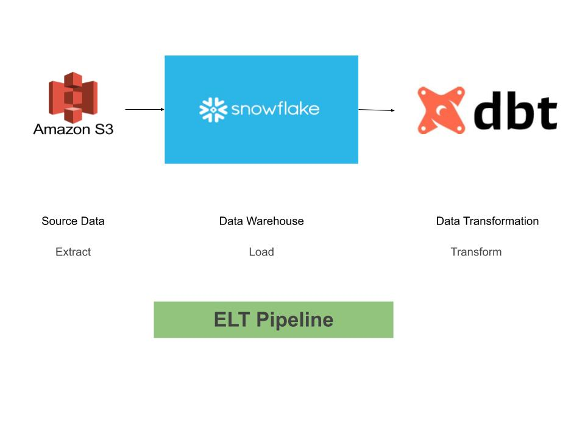

# dbt-ELT

This repository is for the project I made on dbt to create an ELT pipeline. dbt(Data Build Tool) is used for data transformation directly connecting to your data warehouse. There are various advantages of using dbt:
1. It is fast and interactive
2. It uses SQL for data transformation which is much easier than complex codes.
3. You can optimize complex queries using macros provided by jinja template.
4. You can also use packages which make querying fatser and cheaper.

In this project I used AWS S3 as data source. I used Snowflake as my data warehouse to store the data extracted from S3. Then I used dbt to connect with my database containing the required data and performed analytical transformations. These transformations were solely for the purpose of project and to get more familiar with the platform and its dependencies. It does not contain deep insights. Although it can be used to create a dashboard for personal projects but not in any real-world use case.

I hope that you find this project helpful. 
Thank you
